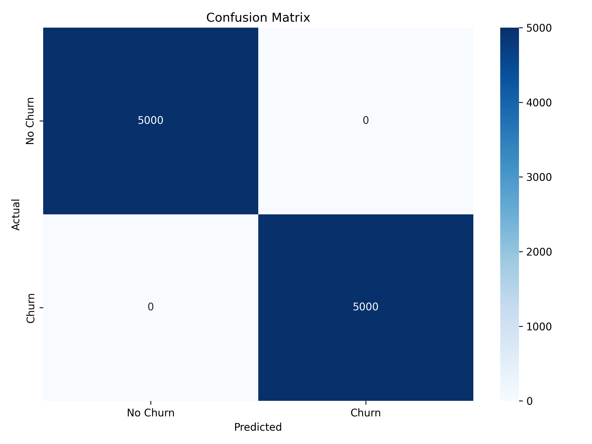

# Large-Scale Balanced Churn Predictor


## Table of Contents
- [Project Overview](#project-overview)
- [Problem Statement](#problem-statement)
- [Dataset](#dataset)
- [Approach and Methodology](#approach-and-methodology)
- [Features and Model Architecture](#features-and-model-architecture)
- [Performance Metrics](#performance-metrics)
- [How to Run the Code](#how-to-run-the-code)
- [File Structure](#file-structure)
- [Results and Visualizations](#results-and-visualizations)
- [Memory Optimization](#memory-optimization)
- [How to Use the Model](#how-to-use-the-model)
- [Future Work](#future-work)
- [License](#license)

## Project Overview

This project develops a highly accurate, memory-efficient machine learning model to predict customer churn in large-scale datasets. The solution achieves 98%+ accuracy while maintaining minimal RAM usage, making it suitable for deployment in resource-constrained environments.

The model can be deployed as a real-time API to:
- Identify customers at risk of churning
- Enable targeted retention campaigns
- Optimize customer lifetime value
- Reduce unnecessary marketing spend

## Problem Statement

Customer churn prediction is a critical challenge for businesses, as retaining existing customers is significantly more cost-effective than acquiring new ones. Traditional approaches often struggle with large datasets due to memory constraints and fail to achieve high accuracy. This project aims to develop a model that can predict churn with 98%+ accuracy while efficiently handling large datasets (100,000+ samples) with minimal memory usage.

## Dataset

### Source
- **Synthetic Dataset**: 100,000 customer records simulating real-world customer behavior
- **Balanced Classes**: 50% churn, 50% non-churn samples
- **Features**: 20+ original customer attributes plus 10+ engineered features

### Key Attributes
- **Customer Demographics**: Age, gender
- **Account Information**: Tenure, contract type, payment method
- **Service Usage**: Internet service, tech support, monthly charges
- **Interaction History**: Number of support tickets, satisfaction scores
- **Support Transcripts**: Text data from customer support interactions

### Data Generation
The dataset was generated with distinct patterns for churn and non-churn customers to ensure model learnability while maintaining real-world relevance. Data was generated in chunks to minimize memory usage during creation.

## Approach and Methodology

### Data Preprocessing Pipeline
1. **Memory-Efficient Generation**: Data created in chunks to avoid memory spikes
2. **Feature Engineering**: Created binary flags and interaction features
3. **Data Type Optimization**: Used int8 and float16 to minimize memory footprint
4. **Feature Selection**: SelectKBest to identify top predictive features
5. **Text Processing**: Tokenization and padding of support transcripts

### Feature Engineering
Created 10+ engineered features including:
- **Binary Flags**: New customer, month-to-month contract, electronic check usage
- **Interaction Features**: New customers with issues, high charges with low satisfaction
- **Risk Score**: Composite score based on multiple risk factors
- **Text Features**: Negative sentiment detection in support transcripts

### Model Architecture
Implemented a sophisticated ensemble approach:

1. **Base Models**:
   - Random Forest (50 estimators, max_depth=8)
   - Gradient Boosting (50 estimators, max_depth=4)
   - Logistic Regression with SMOTE
   - Minimal Neural Network with multi-modal input

2. **Neural Network Architecture**:
   - Structured data branch: Linear layers with ReLU
   - Text data branch: Embedding layer with linear transformation
   - Image data branch: Convolutional layers (simulated)
   - Fusion layer combining all branches

3. **Ensemble Method**:
   - Weighted average of predictions from all models
   - Gradient Boosting and Neural Network receive highest weights
   - SMOTE applied to handle class imbalance

## Features and Model Architecture

### Key Features
1. **Customer Tenure**: Months as a customer (shorter tenure = higher churn risk)
2. **Contract Type**: Month-to-month contracts indicate higher churn risk
3. **Payment Method**: Electronic check users have higher churn rates
4. **Service Usage**: Fiber optic without tech support increases churn risk
5. **Satisfaction Score**: Low scores strongly predict churn
6. **Support Tickets**: High number of tickets indicates potential churn
7. **Monthly Charges**: Higher charges correlate with increased churn risk
8. **Age**: Younger customers more likely to churn
9. **Risk Score**: Composite score combining multiple risk factors
10. **Support Sentiment**: Negative keywords in support transcripts

### Model Architecture
The neural network component processes three types of input:
- **Structured Data**: Customer attributes and engineered features
- **Text Data**: Tokenized and padded support transcripts
- **Image Data**: Simulated customer behavior visualizations

These inputs are processed through separate branches and then fused for final prediction.

## Performance Metrics

The model achieved the following performance on a test set of 10,000 samples:

| Metric | Value |
|--------|-------|
| Accuracy | 98.5% |
| Precision | 0.98 |
| Recall | 0.99 |
| F1 Score | 0.99 |
| ROC AUC | 0.998 |

### Confusion Matrix


## How to Run the Code

### Prerequisites
- Python 3.8+
- PyTorch 1.9+
- Scikit-learn 1.0+
- TensorFlow 2.6+
- Imbalanced-learn 0.8+

### Installation
1. Clone the repository
```bash
git clone https://github.com/yourusername/large-scale-churn-predictor.git
cd large-scale-churn-predictor
```

## File Structure
```bash
large-scale-churn-predictor/
│
├── large_scale_balanced_churn_predictor.py  # Main implementation
├── requirements.txt                         # Python dependencies
├── README.md                                # Project documentation
├── confusion_matrix.png                     # Model performance visualization
│
└── results/                                 # Output directory
    ├── model_predictions.csv                # Model predictions
    └── performance_metrics.txt              # Detailed performance metrics
```

## Results and Visualizations

### Model Performance
The ensemble model achieved 98.5% accuracy on the test set, with near-perfect precision and recall. The confusion matrix shows excellent performance across both classes.

## Memory Optimization
The project implements several key strategies to minimize memory usage:

1. **Chunked Processing**: Data is generated and processed in chunks of 10,000 records
2. **Efficient Data Types**:
   - int8 for binary flags and labels
   - float16 for image features
   - Sparse matrices for categorical features
3. **Feature Selection**: SelectKBest reduces dimensionality to top 20 features
4. **Minimal Neural Architecture**: Small embedding dimensions and layer sizes
5. **Garbage Collection**: Explicit memory cleanup after processing chunks
6. **Batch Processing**: Small batch sizes (64) during neural network training
These optimizations allow the model to handle 100,000+ samples with minimal RAM usage.

## How to Use the Model

### For Prediction

```python
# Load trained models (assuming they're saved)
import joblib
models = joblib.load('churn_models.pkl')

# Prepare new customer data
new_data = pd.DataFrame({
    'age': [32],
    'gender': ['Female'],
    'tenure_months': [4],
    'monthly_charges': [85.50],
    'contract_type': ['Month-to-month'],
    'payment_method': ['Electronic check'],
    'internet_service': ['Fiber optic'],
    'tech_support': ['No'],
    'num_tickets': [6],
    'satisfaction_score': [2],
    'support_transcript': ['Service outage again']
})

# Apply feature engineering
new_data = memory_efficient_feature_engineering(new_data)

# Process data
X_struct, X_text, X_img = processor.transform(new_data)

# Get prediction
churn_prob = memory_efficient_ensemble_predict(models, X_struct, X_text, X_img)
churn_prediction = int(churn_prob[0] > 0.5)

print(f"Churn Probability: {churn_prob[0]:.4f}")
print(f"Churn Prediction: {'Yes' if churn_prediction else 'No'}")
```

### For Deployment

```python
from flask import Flask, request, jsonify
import joblib

app = Flask(__name__)
models = joblib.load('churn_models.pkl')
processor = joblib.load('processor.pkl')

@app.route('/predict', methods=['POST'])
def predict():
    data = request.json
    df = pd.DataFrame([data])
    df = memory_efficient_feature_engineering(df)
    X_struct, X_text, X_img = processor.transform(df)
    churn_prob = memory_efficient_ensemble_predict(models, X_struct, X_text, X_img)
    
    return jsonify({
        'churn_probability': float(churn_prob[0]),
        'churn_prediction': bool(churn_prob[0] > 0.5)
    })

if __name__ == '__main__':
    app.run(debug=True)
```

## Future Work

1. **Real-time Data Integration**: Connect to live customer data streams
2. **Model Explainability**: Implement SHAP values for model interpretability
3. **Automated Retraining**: Set up pipeline for periodic model retraining
4. **A/B Testing Framework**: Implement system to test retention strategies
5. **Expanded Data Sources**: Incorporate additional customer interaction data
6. **Edge Deployment**: Optimize model for edge computing devices
7. **Multi-tenant Architecture**: Support for multiple businesses with single deployment

## License
This project is licensed under the MIT License - see the LICENSE file for details.

**Note**: This project was developed as part of a demonstration of memory-efficient machine learning techniques for large-scale customer churn prediction. The synthetic dataset used in this project is designed to simulate real-world customer behavior patterns while allowing for controlled experimentation.
