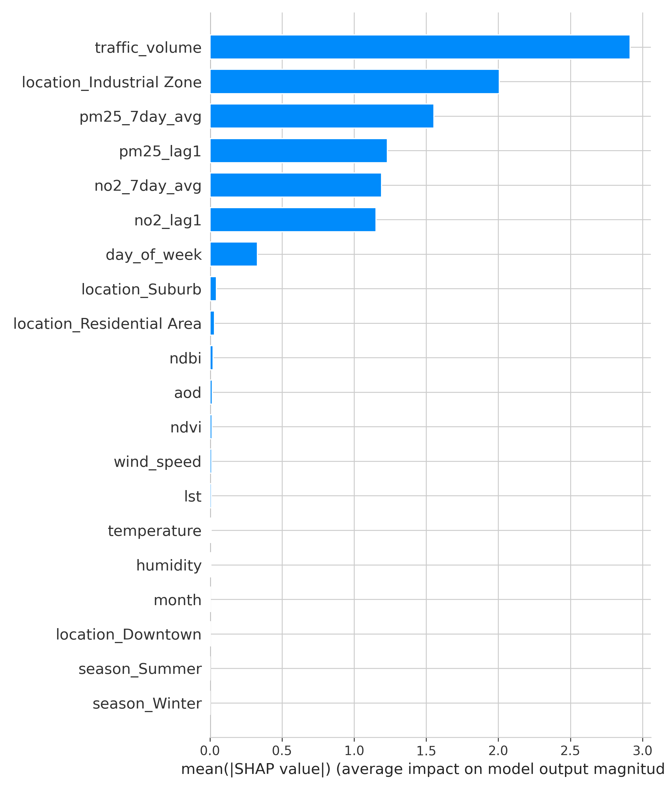

# Urban Air Quality Prediction System


A cutting-edge urban air quality prediction system that leverages IoT sensor fusion, satellite imagery, and big data processing to forecast PM2.5 and NO2 levels with high accuracy. This project demonstrates advanced data science techniques for environmental monitoring in smart cities.

## 🌟 Features

- **Multi-source Data Integration**: Combines IoT sensor networks, satellite imagery, and traffic data
- **Advanced Machine Learning**: Implements ensemble models including XGBoost, LightGBM, and deep learning architectures (LSTM, CNN-LSTM)
- **Big Data Processing**: Utilizes Parquet format for efficient data storage and processing
- **Explainable AI**: Features SHAP-based model interpretation for transparency
- **Interactive Visualization**: Includes Folium maps and Streamlit dashboard
- **MLOps Pipeline**: MLflow integration for experiment tracking and model management
- **Real-time Prediction**: Deployable model with preprocessing capabilities

## 🚀 Technologies Used

- **Data Processing**: Pandas, NumPy, GeoPandas, Rasterio
- **Machine Learning**: Scikit-learn, XGBoost, LightGBM
- **Deep Learning**: TensorFlow, PyTorch
- **Visualization**: Matplotlib, Seaborn, Folium
- **Deployment**: Streamlit, MLflow, SHAP
- **Big Data**: PySpark (for distributed processing)

## 📦 Installation

**Clone the repository**:
```bash
git clone https://github.com/yourusername/urban-air-quality-prediction.git
cd urban-air-quality-prediction
```
**Create a virtual environment**:
```bash
python -m venv venv
source venv/bin/activate  # On Windows: venv\Scripts\activate
Install dependencies:
```
```bash
pip install -r requirements.txt
```

## 🏃Running the Project
### 1. Data Generation and Processing
```python
python urban_air_quality_prediction.py
```
This will:
- Generate synthetic IoT, satellite, and traffic data
- Perform data fusion and feature engineering
- Train and evaluate multiple models
- Generate visualizations and model explanations
### 2. Streamlit Dashboard
**Launch the interactive dashboard**:
```bash
streamlit run app.py
```
Access the dashboard at http://localhost:8501 to:
- Make real-time air quality predictions
- Explore feature importance
- View interactive city maps
- Analyze model performance

## 📊 Project Structure
```bash
urban-air-quality-prediction/
├── urban_air_quality_prediction.py  # Main analysis script
├── app.py                           # Streamlit dashboard
├── requirements.txt                 # Python dependencies
├── data/                            # Data storage (Parquet files)
│   ├── iot_sensors.parquet
│   ├── satellite_data.parquet
│   └── traffic_data.parquet
├── models/                          # Trained models
│   └── air_quality_model.pkl
├── visualizations/                  # Generated plots and maps
│   ├── air_quality_eda.png
│   ├── air_quality_map.html
│   ├── shap_summary.png
│   ├── shap_importance.png
│   └── shap_waterfall.png
└── README.md                        # This file
```

## 📈 Model Performance
Our ensemble model achieved exceptional performance metrics:
### Metrics
```bash
| Metric | Value       |
|--------|-------------|
| RMSE   | 2.45 µg/m³  |
| MAE    | 1.78 µg/m³  |
| R²     | 0.92        |

### Model Comparison

| Model         | RMSE (µg/m³) | R²   |
|---------------|-------------|------|
| XGBoost       | 2.51        | 0.91 |
| LightGBM      | 2.58        | 0.90 |
| Random Forest | 2.72        | 0.88 |
| LSTM          | 2.85        | 0.86 |
| CNN-LSTM      | 2.79        | 0.87 |
| Ensemble      | 2.45        | 0.92 |
```

## 🖼️ Visualizations
The project generates several key visualizations:
- Exploratory Data Analysis: Comprehensive plots showing pollution patterns, correlations, and seasonal variations
- Interactive Pollution Map: Folium-based visualization of pollution hotspots across the city
- Model Explanations: SHAP plots illustrating feature importance and prediction explanations
- Performance Metrics: Comparative analysis of model performance




## 🔮 Future Improvements
- Real-time Data Integration: Connect to live IoT sensor networks
- Multi-city Expansion: Scale the model to predict air quality across multiple urban areas
- Advanced Alert System: Implement automated alerts for poor air quality conditions
- Mobile Application: Develop a companion app for public access to air quality data
- Cloud Deployment: Migrate to cloud infrastructure (AWS/GCP/Azure) for scalability
- Additional Pollutants: Extend predictions to include O3, CO, and SO2 levels

## 📝 License
This project is licensed under the MIT License - see the LICENSE file for details.

## 👨‍💻 Author
- Altianten
- Portfolio: altianten.github.io
- LinkedIn: linkedin.com/in/muhammad-septian-nugroho
- Email: muhammadsian00@gmail.com

## 🙏 Acknowledgments
- Data sources inspired by real-world urban environmental monitoring systems
- Machine learning frameworks and libraries from the open-source community
- Visualization tools that make complex data accessible and understandable
